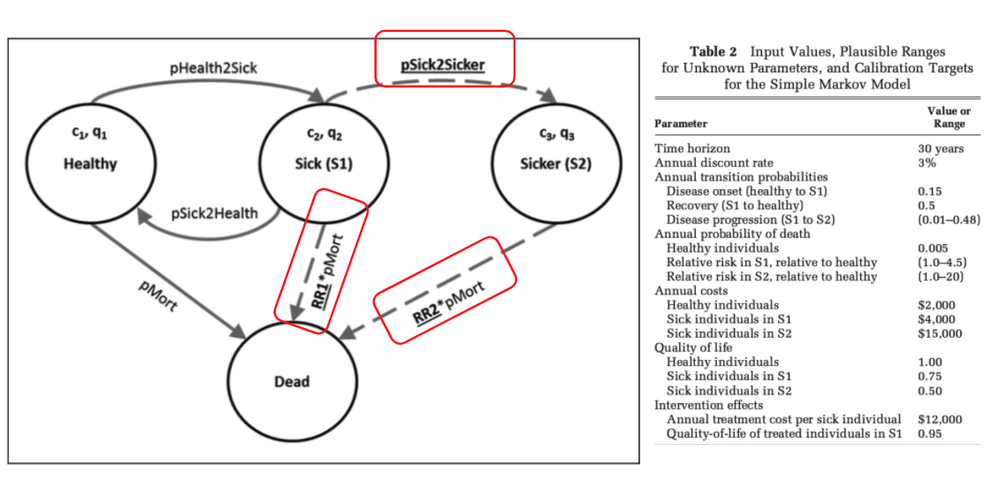

<br><hr>

# INTRODUCTION 

This simulation study aims to compare the performance of the Pareto Frontier approach for model calibration against a distance-based summary score (selecting the 1% of inputs sets that minimise the sum of absolute differences between model outputs and calibration targets).

We conducted a simulation study, using the well-documented Sick-Sicker Model. As in the original study, three parameters were calibrated: pS1_S2, RRS1_D, and RRS2_D (see figure below and/or the `drawParams` and `runTrueMarkov` functions in `./R/functions.R`)




First we illustrate the methods using a single true set of parameters and assess the performance (in terms of iNMB) against a single fixed (setion 1.1) and uncertain (section 1.2) set of calibration targets.

We then expand the simulation and test the performance of the Pareto Frontier approach more systematically for any true input parameter values and across different numbers of calibration iterations and four different target sets, whereby we consider fixed (2.1) as well as stochastic target sets (2.2).

* True parameters were drawn from the following distributions:

  * pS1_S2 = random uniform 0.01-0.48 
  * RRS1_D = random uniform 1, 4.5 
  * RRS2_D = random uniform 1 - 20
  
* The number of test sets take the following values: 

  * 500, 1,000, 5,000, 10,000, 20,000, 50,000

* Targets:
  * t1 = survival at year 5
  * t2 = survival at year 10
  * t3 = disease prevalence at year 5
  * t4 = sick / sicker ration at year 5
  * t5 = sick prevlanece at year 10
  * t6 = sicker prevlanece at year 10
  
* Target sets:
  * TS1 = {t1,t2,t3,t4}
  * TS2 = {t1, t5, t6}
  * TS3 = {t2, t5}
  * TS4 = {t1, t1, t2, t3, t5, t6}


# 0 SETUP

```{r}
# LOAD PACKAGES AND FUNCTIONS
library(rPref)
library(reshape2)
library(ggplot2)
library(foreach)
library(parallel)

source("./R/functions.R")
```


```{r}
# META PARAMS
HORIZON <- 30
DISC_RATE <- 0.03
THRESH <- 1000

set.seed(2021)
```

<br><hr>

# 1.1 SIMULATION STUDY: SINGLE TRUE PARAMETER SET AND FIXED CALIBRATION TARGETS

This analysis aims to provide some intuition for the simulation analysis. It shows the computation for a single case, with a fixed set of true model parameters and corresponding calibration targets. It closely mirrors the original study by Enns et al. (2015). 

```{r}
# Number of candidate input sets being evaluated
  n_calib <- 10000

# true markov model with fixed parameters  
  true_params <- drawParams(pS1_S2 = 0.02, RRS1_D = 3, RRS2_D = 15)
  true_model <- runTrueMarkov(params = true_params[1,], return_targets = T)
  # corresponding true inmb
  true_inmb <- true_model$ce_res[4]
  

# Derive true caloibration targets (without uncertainty)
  target_set <- true_model$targets    # True targets
  target_set[1:4]
  
# run calibration and estimate iNMB
  # draw random test params
  test_params <- drawParams(
    pS1_S2 = runif(n_calib, 0.01, 0.48),
    RRS1_D =  runif(n_calib, 1, 4.5),
    RRS2_D = runif(n_calib, 1, 20)
    )
  
  # run model for all random param sets and compre to targets
  calib_res <- runCalibration(
    params = test_params, 
    targets = target_set, 
    RUNS = n_calib
    )
  
  # evaluate target achievement and select winning param sets
  selected_sets <- evalTargets(target_diff = calib_res$res_mat)
    
  # retrieve results over selected param sets
  res_list <- evalRes(selected_sets, test_params, true_inmb)
  
  # number of paremter sets selected
  table(res_list$res_df$L1)
  
  # true inmb
  true_inmb
  
  # estimated inb and abs error
  res_list$inmb_df
  
  # ICER plane
  ggplot() +
    geom_point(
      data = res_list$res_df, 
      aes(x = incr_C, y = incr_Q, col = L1), 
      alpha = 0.5, size = 1
      ) +
    geom_point(
      aes(
        x = true_model$ce_res["incr_C"], 
        y = true_model$ce_res["incr_Q"], 
        col = "True"
        ), alpha = 2
      ) +
    xlim(c(45000, 80000)) +
    ylim(c(0.35, 0.8)) +
    theme_minimal()
  
```

<br><hr>

# 1.2 SIMULATION STUDY: SINGLE TRUE PARAMETER SET AND (SINGLE) UNCERTAIN CALIBRATION TARGETS

Same as above with micro simulation to generate stochastic calibration targets.

```{r}
# Number of candidate input sets being evaluated
  n_calib <- 10000

# true markov model with fixed parameters  
  true_params <- drawParams(pS1_S2 = 0.02, RRS1_D = 3, RRS2_D = 15)
  true_model <- runTrueMarkov(params = true_params[1,], return_targets = T)
  # corresponding true inmb
  true_inmb <- true_model$ce_res[4]
  

# Derive true caloibration targets (without uncertainty)
  target_set <- simStudy(n = 1000, true_params = true_params[1,]) #micro sim
  target_set[1:4]
  
# run calibration and estimate iNMB
  # draw random test params
  test_params <- drawParams(
    pS1_S2 = runif(n_calib, 0.01, 0.48),
    RRS1_D =  runif(n_calib, 1, 4.5),
    RRS2_D = runif(n_calib, 1, 20)
    )
  
  # run model for all random param sets and compre to targets
  calib_res <- runCalibration(
    params = test_params, 
    targets = target_set, 
    RUNS = n_calib
    )
  
  # evaluate target achievement and select winning param sets
  selected_sets <- evalTargets(target_diff = calib_res$res_mat)
    
  # retrieve results over selected param sets
  res_list <- evalRes(selected_sets, test_params, true_inmb)
  
  # number of paremter sets selected
  table(res_list$res_df$L1)
  
  # true inmb
  true_inmb
  
  # estimated inb and abs error
  res_list$inmb_df
  
  # ICER plane
  ggplot() +
    geom_point(
      data = res_list$res_df, 
      aes(x = incr_C, y = incr_Q, col = L1), 
      alpha = 0.5, size = 1
      ) +
    geom_point(
      aes(
        x = true_model$ce_res["incr_C"], 
        y = true_model$ce_res["incr_Q"], 
        col = "True"
        ), alpha = 2
      ) +
    xlim(c(45000, 80000)) +
    ylim(c(0.35, 0.8)) +
    theme_minimal()
  
```

<br><hr>

# 2.1 SIMULATION STUDY: RANDOM PARAMETER SETS AND FIXED CALIBRATION TARGETS

Analysis steps in short:

  1. Randomly draw 10,000 sets of true parameters
  2. Compute true inmb and derive fixed calibration targets
  3. run model calibration with 500, 1,000, ..., 50,000 test parameter sets
  4. Evaluate target fits and select best fitting sets
  5. Compare estimated and true inmb and parameter values


## RUN SIMULATION

Consider running this in parallel in the cloud - otherwise, this may take >24h to run. 
```{r eval=FALSE, include=FALSE}
# # NOT RUN LOCALLY:
# source("./R/sim_fixed.R")
```

<br><br>

## ANALYSE RESULTS

### RE-ARRANGE THE DATA 
```{r}
# load simulation results
res_mat <- data.frame(readRDS("./output/res_fixed.RDS"))
# re-format
for(i in c(1,3:ncol(res_mat))){
  res_mat[,i] <- as.numeric(res_mat[,i])
}

names(res_mat) <- c(
  "run","method","inmb","inmb_error","inmb_error_abs","pareto_diff",
  "pS1_S2_diff", "RRS1_D_diff", "RRS2_D_diff","run2",
  "n_calib","pareto_n","n_study_size","true_inmb"
  )
res_mat$target_set <- rep(c(1,2,3,4), each = 3) # forgot to specify this previously

res_mat <- res_mat[res_mat$method %in% c("pareto", "sum_percent"),]
dim(res_mat)
head(res_mat)

# relative performance of pareto vs sum
pareto_diff_abs <- res_mat$inmb_error_abs[res_mat$method == "pareto"] - res_mat$inmb_error_abs[res_mat$method == "sum_percent"]

pareto_params_diff_abs <- abs(res_mat[res_mat$method == "pareto", c("pS1_S2_diff", "RRS1_D_diff", "RRS2_D_diff")]) - abs(res_mat[res_mat$method == "sum_percent", c("pS1_S2_diff", "RRS1_D_diff", "RRS2_D_diff")])
names(pareto_params_diff_abs)<-paste0("pareto_", names(pareto_params_diff_abs))
overall_diff_df <- res_mat[res_mat$method == "pareto",]
overall_diff_df$pareto_diff_abs <- pareto_diff_abs
overall_diff_df <- cbind(overall_diff_df,pareto_params_diff_abs)


# ref: calib 50,000
ref_df <- subset(res_mat, n_calib == 50000)
```

<br><br>

### incrmenetal net monetary benefit - absolute error

```{r}
# incr NMB --------
aggregate(inmb_error_abs ~ method + target_set, ref_df, aggFormat, show_range = T)

aggregate(pareto_diff_abs ~ n_calib + target_set, overall_diff_df[overall_diff_df$n_calib == 50000,], aggFormat, show_range = T)

# by n_calib
aggregate(inmb_error_abs ~ method+n_calib + target_set, res_mat, aggFormat, show_range = T)
aggregate(pareto_diff_abs ~ n_calib + target_set, overall_diff_df, aggFormat, show_range = T)

# true incr nmb
mean(ref_df$true_inmb); sd(ref_df$true_inmb)


# plot 1: abs error for n_calib = 50,000
inmb_error_abs_means <- aggregate(inmb_error_abs ~method+target_set,ref_df,mean )
ggplot(ref_df) +
  geom_density(aes(x = inmb_error_abs,col = method,fill = method), alpha = 0.5, position = "identity") +
  geom_vline(data = inmb_error_abs_means, aes(xintercept = inmb_error_abs, col = method)) +
  facet_wrap(~target_set) +
  coord_cartesian(xlim = c(0, 20000)) +
  xlab("Absolute error in Incremental Net Monetary Benefit") +
  theme_minimal() +
  theme(legend.position = "top")

# plot 2: abs error by n_calib
ggplot(res_mat) +
  geom_boxplot(aes(y=inmb_error_abs, x = as.factor(n_calib), fill = method)) +
  facet_wrap(~target_set, ncol = 1) +
  ylab("Absolute error in Incremental Net Monetary Benefit") +
  xlab("Number of candidate input parameter sets being evaluated") +
  theme_minimal() +
  coord_cartesian(ylim=c(0,40000)) +
  theme(legend.position = "top")
```

<br><br>

### calibration parameters - absolute error

```{r}
# params abs error --------
aggregate(abs(cbind(pS1_S2_diff,RRS1_D_diff,RRS2_D_diff)) ~ method + target_set, ref_df, aggFormat, digits = 3)

aggregate(cbind(pareto_pS1_S2_diff,pareto_RRS1_D_diff,pareto_RRS2_D_diff) ~ method + target_set, overall_diff_df[overall_diff_df$n_calib == 50000,], aggFormat, digits = 3)

# by n_calib
aggregate(abs(cbind(pS1_S2_diff,RRS1_D_diff,RRS2_D_diff)) ~ method + n_calib + target_set, res_mat, aggFormat, digits = 3)
aggregate(cbind(pareto_pS1_S2_diff,pareto_RRS1_D_diff,pareto_RRS2_D_diff) ~ n_calib + target_set, overall_diff_df, aggFormat, digits = 3)


ref_df_params <- data.frame(
  method = ref_df$method, target_set= ref_df$target_set,
  abs(cbind(pS1_S2_diff=ref_df$pS1_S2_diff,RRS1_D_diff=ref_df$RRS1_D_diff,RRS2_D_diff=ref_df$RRS2_D_diff))
  )
ref_df_params_long <- melt(ref_df_params, id.vars = c("target_set","method"))

params_abs_means <- aggregate(cbind(pS1_S2_diff,RRS1_D_diff,RRS2_D_diff) ~method+target_set,ref_df_params,mean )
params_abs_means_long <- melt(params_abs_means)

ggplot(ref_df_params_long) +
  geom_density(aes(x = value,col = method,fill = method), alpha = 0.5, position = "identity") +
  # geom_vline(data = inmb_error_abs_means, aes(xintercept = inmb_error_abs, col = method)) +
  facet_wrap(~target_set+variable, ncol = 3, scales = "free") +
  # coord_cartesian(xlim = c(0, 20000)) +
  # xlab("Absolute error in Incremental Net Monetary Benefit") +
  theme_minimal() +
  theme(legend.position = "top")
```

<br><br>

### Pareto Frontier: number of selected parameter sets

The number of selected parameter sets varies considerably, depending on the number of test sets and by random sampling variation. With low numbers of test sets, the Pareto Frontier approach may pccasionally end up selecting just 1 parameter set.


```{r}
# pareto n size -----
pareto_n_df <- subset(res_mat, method == "pareto")

pareto_n_df_agg <- aggregate(pareto_n ~ n_calib + target_set, pareto_n_df, 
          function(x){
            y <- c("mean" = mean(x), "sd" = sd(x), quantile(x, c(0.5, 0.25, 0.75, 0, 1)))
            y <- formatC(y, digits = 0, format = "f", big.mark = ",")
            y <- c(
              "mean (SD)" = paste0(y[1], " (",y[2],")"),
              # "median (IQR)" = paste0(y[3], " (",y[4],"; ",y[5],")")#,
              "range" = paste0("[",y[6], "; ",y[7],"]")
            )
            y})


pareto_n_df_agg <- reshape(pareto_n_df_agg, direction = "wide", timevar = "target_set", idvar = "n_calib")
colnames(pareto_n_df_agg) <- c("n_calib" , paste("Target",1:4))
pareto_n_df_agg
```

<br><hr>

# 2.2 SIMULATION STUDY: RANDOM PARAMETER SETS AND UNCERTAIN CALIBRATION TARGETS

Analysis steps in short:

  1. Randomly draw 10,000 sets of true parameters
  2. Compute true inmb and simulate a target set using a micro simulation 
  3. run model calibration with 10,000 test parameter sets
  4. Evaluate target fits and select best fitting sets
  5. Compare estimated and true inmb and parameter values


## RUN SIMULATION

Consider running this in parallel in the cloud - otherwise, this may take >24h to run. 
```{r eval=FALSE, include=FALSE}
# # NOT RUN LOCALLY:
# source("./R/sim_uncertain.R")
```

<br><br>

## ANALYSE RESULTS

### RE-ARRANGE THE DATA 
```{r}
res_uncertain <- data.frame(load_object("./output/res_uncertain.RData")) # couldnt save as rds
for(i in c(1,3:ncol(res_uncertain))){
  res_uncertain[,i] <- as.numeric(res_uncertain[,i])
}
# because of the stochastic ratio target, some results fail with NA outcomes if ratio = 0 or Inf 
res_uncertain <- res_uncertain[complete.cases(res_uncertain),]
names(res_uncertain) <- c(
  "run","method","inmb","inmb_error","inmb_error_abs","pareto_diff",
  "pS1_S2_diff", "RRS1_D_diff", "RRS2_D_diff",
  "target_set","pareto_n","n_study_size","true_inmb"
)

res_uncertain <- res_uncertain[res_uncertain$method %in% c("pareto", "sum_percent"),]
dim(res_uncertain)
head(res_uncertain)

# relative performance of pareto vs sum
pareto_diff_abs <- res_uncertain$inmb_error_abs[res_uncertain$method == "pareto"] - res_uncertain$inmb_error_abs[res_uncertain$method == "sum_percent"]
pareto_params_diff_abs <- abs(res_uncertain[res_uncertain$method == "pareto", c("pS1_S2_diff", "RRS1_D_diff", "RRS2_D_diff")]) - abs(res_uncertain[res_uncertain$method == "sum_percent", c("pS1_S2_diff", "RRS1_D_diff", "RRS2_D_diff")])
names(pareto_params_diff_abs)<-paste0("pareto_", names(pareto_params_diff_abs))
overall_diff_df <- res_uncertain[res_uncertain$method == "pareto",]
overall_diff_df$pareto_diff_abs <- pareto_diff_abs
overall_diff_df <- cbind(overall_diff_df,pareto_params_diff_abs)
```

<br><br>

### incrmenetal net monetary benefit - absolute error

```{r}
# incr NMB --------
aggregate(inmb_error_abs ~ method + target_set, res_uncertain, aggFormat, show_range = T)
aggregate(pareto_diff_abs ~ target_set, overall_diff_df, aggFormat, show_range = T)

# # true values
# mean(res_t1$true_inmb); sd(res_t1$true_inmb)


```

<br><br>

### calibration parameters - absolute error

```{r}
# params -----
aggregate(cbind(pS1_S2_diff,RRS1_D_diff,RRS2_D_diff) ~ method + target_set, res_uncertain, aggFormat,digits = 3)

aggregate(cbind(pareto_pS1_S2_diff,pareto_RRS1_D_diff,pareto_RRS2_D_diff) ~ method + target_set, overall_diff_df, aggFormat,digits = 3)

```

<br><br>

### Effect of sample size / uncertainty in calibration targets on relative performance of the Pareto Frontier approach compared to the dostance-based score
```{r}
# PLOT
sample_df <- overall_diff_df[sample(1:nrow(overall_diff_df),100000), ] # easier to draw
ggplot(sample_df) +
  geom_point(aes(x=n_study_size, y= pareto_diff_abs), size = 0.1, alpha =0.3) +
  geom_smooth(aes(x=n_study_size, y= pareto_diff_abs), se = T) +
  geom_hline(yintercept = 0, col = "red", linetype = "dashed") +
  facet_wrap(~target_set) +
  xlab("Size of micro simulation used to generate target set") +
  ylab("Abs error iNMB compared to distance-based score") +
  theme_minimal()
```


<br><hr>

fin.